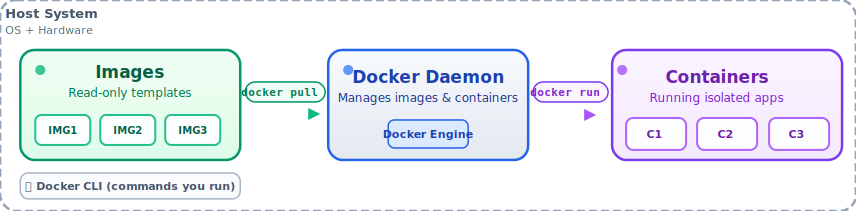
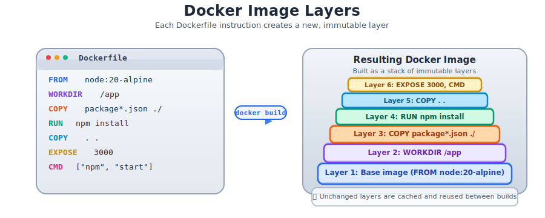

# Basic Docker Commands

`Docker` is a platform for developing, shipping, and running applications inside containers.

## Docker Architecture Overview



The diagram above shows `Docker`'s architecture with the `Docker` daemon, containers, images, and the host system.

> [!TIP]
> 
> Use `docker <command> --help` for more details on any command.

- **Check Docker version**  
    ```bash
    docker --version
    ```
    Displays the installed `Docker` version.

- **Pull an image from Docker Hub**  
    ```bash
    docker pull <image_name>:<tag>
    ```
    Downloads a Docker image (e.g., `docker pull ubuntu:latest`) from [`Dockerhub`](https://hub.docker.com/). Defaults to `latest` tag if not specified.

- **List all images**  
    ```bash
    docker image ls
    ```
    Shows all `Docker` images available on your system.

- **Run a container**  
    ```bash
    docker run <image_name>:<tag>
    ```
    Starts a container from an image. Use `-d` to run in detached mode, `--name <name>` to name the container, or `-p <host-port>:<container-port>` to map ports.

- **List running containers**  
    ```bash
    docker ps
    ```
    Displays all currently running containers. Use `docker ps -a` to include stopped containers.

- **Stop a container**  
    ```bash
    docker stop <container_id>
    ```
    Stops a running container. Get the `<container_id>` from `docker ps`.

- **Remove a container**  
    ```bash
    docker rm <container_id>
    ```
    Deletes a stopped container.

- **Remove an image**  
    ```bash
    docker rmi <image_name>
    ```
    Deletes a `Docker` image from your system.

- **View container logs**  
    ```bash
    docker logs <container_id>
    ```
    Displays the logs of a container.

- **Execute a command in a running container**  
    ```bash
    docker exec -it <container_id> <command>
    ```
    Runs a command (e.g., `bash`) inside a running container interactively.

- **List networks**  
    ```bash
    docker network ls
    ```
    Shows all `Docker` networks.

- **Create a network**  
    ```bash
    docker network create <network_name>
    ```
    Creates a custom network for containers to communicate.

## Dockerfile



The diagram above shows how `Docker` images are built in layers, with each instruction creating a new layer.

The `Dockerfile` is a text document that contains all the commands to assemble a customized image. This file contains a series of commands and arguments that are executed automatically in order to assemble an image. 

### Dockerfile Instructions

The main components of a `Dockerfile` include:

<dl>
    <dt>FROM</dt> 
        <dd> Specifies the base image to use. </dd>
    <dt>COPY</dt> 
        <dd> Copies files from the host to the image. </dd>
    <dt>RUN</dt> 
        <dd> Executes commands in the image during the build process. </dd>
    <dt>EXPOSE</dt> 
        <dd> Documents which ports the container listens on. </dd>
    <dt>ENV</dt> 
        <dd> Sets environment variables. </dd>
    <dt>WORKDIR</dt> 
        <dd> Sets the working directory for subsequent instructions.
    <dt>ENTRYPOINT</dt> 
        <dd> Sets the main executable that will always run in the container, regardless of additional command-line arguments. </dd>
    <dt>CMD</dt> 
        <dd> Provides default arguments to the `ENTRYPOINT` or specifies a default command if `ENTRYPOINT` is not set; can be overridden when running the container. </dd>
</dl>

- **Build an image from a Dockerfile**  
    ```bash
    docker build -t <image_name>:<tag> .
    ```
    Builds a `Docker` image from a `Dockerfile` in the current directory.

- **Build with no cache**  
    ```bash
    docker build --no-cache -t <image_name>:<tag> .
    ```
    Builds an image without using cached layers.

- **Build with build context**  
    ```bash
    docker build -f <dockerfile_path> -t <image_name>:<tag> <build_context>
    ```
    Builds using a specific Dockerfile and build context.

- **Push an image to Dockerhub**
    ```bash
    docker push <image_name>:<tag>
    ```

> [!WARNING]
> 
> Use `docker login` to authenticate with [`Dockerhub`](https://hub.docker.com/) for pushing images.

## Docker Compose
`Docker Compose` is a tool for defining and running multi-container `Docker` applications.

- **Start services defined in a `docker-compose.yml` file**  
    ```bash
    docker-compose up
    ```
    Starts all services defined in the `docker-compose.yml` file. Use `-d` for detached mode.

- **Stop and remove services**  
    ```bash
    docker-compose down
    ```
    Stops and removes containers, networks, and volumes defined in `docker-compose.yml`.

> [!TIP]
> 
> Use `docker system prune` to remove unused containers, images, and networks.

[Go Back](../README.md)
