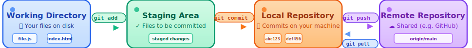

# Basic Git and GitHub Commands

These commands cover the basics of version control with `Git` and interacting with [`GitHub`](https://github.com/) repositories.

## Git Workflow Overview



The diagram above shows the basic Git workflow: **Working Directory** → **Staging Area** → **Local Repository** → **Remote Repository**.

> [!IMPORTANT]
>
> You need to set your identity at first:
> ```bash
> git config --global user.name "Your Name"
> git config --global user.email "your.email@example.com"
> ```

## Git Basics

`Git` is a version control system for tracking changes in code.

- **Initialize a Git repository**  
    ```bash
    git init
    ```
    Creates a new `Git` repository in the current directory.

- **Check repository status**  
    ```bash
    git status
    ```
    Shows the current state of the working directory and staging area.

- **Stage files for commit**  
    ```bash
    git add <file>
    ```
    Adds a specific file to the staging area. Use `git add .` to stage all changes.

- **Commit changes**  
    ```bash
    git commit -m "commit message"
    ```
    Saves staged changes with a descriptive message.

- **View commit history**  
    ```bash
    git log
    ```
    Displays the commit history for the repository.

## Git Branching

<!--  -->

Git branching allows you to work on different features or fixes in isolation.

- **Create a new branch**  
    ```bash
    git branch <branch-name>
    ```
    Creates a new branch for isolated development.

- **Switch to a branch**  
    ```bash
    git checkout <branch_name>
    ```
    Switches to the specified branch. Use `git checkout -b <branch_name>` to create and switch in one step.

- **List all branches**  
    ```bash
    git branch -a
    ```
    Shows all local and remote branches.

- **Delete a branch**  
    ```bash
    git branch -d <branch_name>
    ```
    Deletes the specified branch (use `-D` for force delete).

- **Merge branches**  
    ```bash
    git merge <branch_name>
    ```
    Merges the specified branch into the current branch.

<!-- 

The diagram above shows how Git merges work, creating a new merge commit that combines changes from different branches. -->

## Git Comparison and History

- **View differences**  
    ```bash
    git diff
    ```
    Shows changes between the working directory and the last commit.

- **View differences between commits**  
    ```bash
    git diff <commit1> <commit2>
    ```
    Shows differences between two specific commits.

- **View differences in staging area**  
    ```bash
    git diff --staged
    ```
    Shows changes that are staged for commit.

- **View commit history with graph**  
    ```bash
    git log --oneline --graph --all
    ```
    Shows a visual representation of commit history and branches.

> [!TIP]
>
> Use `git help <command>` for more details on any command.
>
> [Git Cheat Sheet](https://wac-cdn.atlassian.com/dam/jcr:e7e22f25-bba2-4ef1-a197-53f46b6df4a5/SWTM-2088_Atlassian-Git-Cheatsheet.pdf?cdnVersion=2969)

## GitHub Basics

[`GitHub`](https://github.com/) is a platform for hosting and collaborating on `Git` repositories.

- **Clone a repository**  
    ```bash
    git clone <repository_url>
    ```
    Downloads a repository from [`GitHub`](https://github.com/) to your local machine.

- **Link local repository to GitHub**  
    ```bash
    git remote add origin <repository_url>
    ```
    Connects your local repository to a remote [`GitHub`](https://github.com/) repository.

- **Push changes to GitHub**  
    ```bash
    git push origin <branch_name>
    ```
    Uploads local commits to the specified branch on [`GitHub`](https://github.com/).

- **Pull changes from GitHub**  
    ```bash
    git pull origin <branch_name>
    ```
    Downloads and merges changes from the specified branch on [`GitHub`](https://github.com/).

> [!CAUTION] 
> 
> If `git merge` or `git pull` results in conflicts, edit the conflicting files, stage them with `git add`, and complete the commit.

> [!NOTE]
> 
> To create a pull request on [`GitHub`](https://github.com/) 's website:
>
>     1. Navigate to the repository.
>     2. Click the "Fork" button.
>     2. Click the "Pull requests" tab.
>     3. Click "New pull request" and select the branches to compare.
>     4. Add a title and description, then submit.

[Go Back](../README.md)
