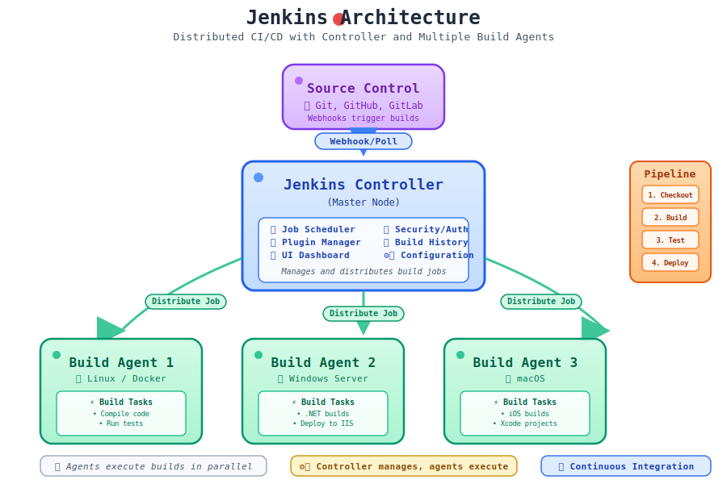
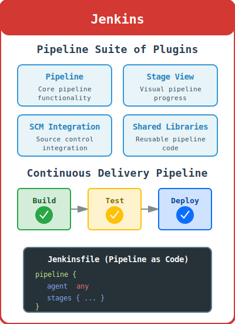
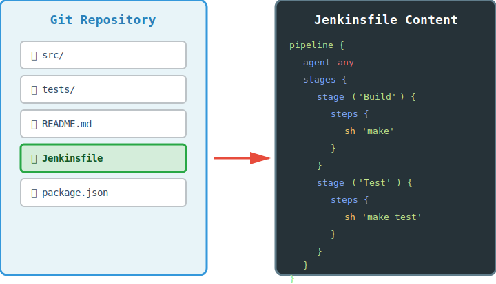

# Basic Jenkins CI/CD Commands

**Jenkins** is an open-source automation server that enables developers to build, test, and deploy their software projects through continuous integration and continuous delivery (`CI`/`CD`) pipelines.

## Jenkins Architecture Overview



The diagram above shows Jenkins' architecture with the **Jenkins** controller managing multiple agents for distributed builds and deployments.

> [!IMPORTANT]
> 
> **Jenkins** uses a master-agent architecture where the controller manages jobs and agents execute the actual build tasks.

## Jenkins Installation and Setup

- **Check Jenkins version**  
  ```bash
  jenkins --version
  ```
  Displays the installed **Jenkins** version.

- **Start Jenkins service**  
  ```bash
  sudo systemctl start jenkins
  sudo systemctl enable jenkins
  ```
  Starts and enables **Jenkins** to run on boot.

- **Check Jenkins status**  
  ```bash
  sudo systemctl status jenkins
  ```
  Shows the current status of the **Jenkins** service.

- **Access Jenkins web interface**  
  ```
  http://localhost:8080
  ```
  Opens **Jenkins** web interface in your browser (default port 8080).

- **Unlock Jenkins**  
  ```bash
  sudo cat /var/lib/jenkins/secrets/initialAdminPassword
  ```
  Retrieves the initial admin password for **Jenkins** setup.

Continue the **Jenkins** setup by following the web interface instructions.

## Jenkins Pipeline



**Jenkins** Pipeline is a suite of plugins that supports implementing and integrating continuous delivery pipelines into **Jenkins**.

### Pipeline Syntax

- **Declarative Pipeline**  
  ```groovy
  pipeline {
      agent any
      stages {
          stage('Build') {
              steps {
                  echo 'Building...'
              }
          }
          stage('Test') {
              steps {
                  echo 'Testing...'
              }
          }
          stage('Deploy') {
              steps {
                  echo 'Deploying...'
              }
          }
      }
  }
  ```

- **Scripted Pipeline**  
  ```groovy
  node {
      stage('Build') {
          echo 'Building...'
      }
      stage('Test') {
          echo 'Testing...'
      }
      stage('Deploy') {
          echo 'Deploying...'
      }
  }
  ```

## Jenkinsfile Structure



A **Jenkinsfile** is a text file that contains the definition of a **Jenkins** Pipeline and is checked into source control.

### Common Pipeline Steps

- **Checkout source code**  
  ```groovy
  checkout scm
  ```

- **Build with Maven**  
  ```groovy
  sh 'mvn clean package'
  ```

- **Build with Gradle**  
  ```groovy
  sh './gradlew build'
  ```

- **Build with Docker**  
  ```groovy
  sh 'docker build -t myapp:${BUILD_NUMBER} .'
  ```

- **Run tests**  
  ```groovy
  sh 'mvn test'
  sh 'npm test'
  sh 'pytest'
  ```

- **Essential plugins**:
  - **Blue Ocean**: Modern user interface for Jenkins
  - **Pipeline**: Core pipeline functionality
  - **Git**: Git integration
  - **Docker**: Docker integration
  - **Ansible**: Ansible integration
  - **Kubernetes**: Kubernetes integration
  - **Slack**: Slack notifications
  - **Email Extension**: Enhanced email notifications

<!--
## Jenkins Agents and Nodes

- **List all nodes**  
  ```bash
  java -jar jenkins-cli.jar -s http://localhost:8080 get-node
  ```
  Shows all configured **Jenkins** nodes.

- **Create a new node**  
  ```bash
  java -jar jenkins-cli.jar -s http://localhost:8080 create-node <node-name> < config.xml
  ```
  Creates a new **Jenkins** agent node.

- **Connect agent to master**  
  ```bash
  java -jar agent.jar -jnlpUrl http://localhost:8080/computer/<agent-name>/slave-agent.jnlp -secret <secret>
  ```
  Connects an agent to the **Jenkins** master.
-->

## Jenkins Security

- **Enable security**  
  ```bash
  # Configure in **Jenkins** web interface: Manage Jenkins > Configure Global Security
  ```

<!--
- **Create user**  
  ```bash
  java -jar jenkins-cli.jar -s http://localhost:8080 create-user <username> <password>
  ```
  Creates a new **Jenkins** user.
-->

- **Set up SSH keys**  
  ```bash
  # Add SSH public key in **Jenkins** web interface: Manage Jenkins > Manage Users > Configure
  ```

## Jenkins Backup and Maintenance

- **Backup Jenkins**  
  ```bash
  tar -czf jenkins-backup-$(date +%Y%m%d).tar.gz /var/lib/jenkins
  ```
  Creates a backup of **Jenkins** configuration and data.

- **Restore Jenkins**  
  ```bash
  tar -xzf jenkins-backup-YYYYMMDD.tar.gz -C /
  ```
  Restores **Jenkins** from a backup.

- **Restart Jenkins**  
  ```bash
  sudo systemctl restart jenkins
  ```
  Restarts the **Jenkins** service.

## Jenkins Integration Examples

### Git Integration
```groovy
pipeline {
    agent any
    triggers {
        githubPush()
    }
    stages {
        stage('Checkout') {
            steps {
                git url: 'git@github.com:a-mhamdi/devops-mwe.git', branch: 'main'
            }
        }
    }
}
```

### Docker Integration
```groovy
pipeline {
    agent any
    stages {
        stage('Build Docker Image') {
            steps {
                sh 'docker build -t abmhamdi/devops-mwe:${BUILD_NUMBER} .'
            }
        }
        stage('Push to Registry') {
            steps {
                sh 'docker push abmhamdi/devops-mwe:${BUILD_NUMBER}'
            }
        }
    }
}
```

### Kubernetes Integration
```groovy
pipeline {
    agent any
    stages {
        stage('Deploy to K8s') {
            steps {
                sh 'kubectl apply -f k8s/'
            }
        }
    }
}
```

## Docker Commands for Jenkins
- **Run Jenkins in Docker**  
  ```bash
  docker run -d -p 8080:8080 -p 50000:50000 --name jenkins -v jenkins_home:/var/jenkins_home jenkins/jenkins
  ```
  Starts a **Jenkins** container.

- **Stop Jenkins container**  
  ```bash
  docker stop jenkins
  ```
  Stops the **Jenkins** container.
  
- **Access to Jenkins container**
  ```bash
  docker exec -it jenkins bash
  ```
  Access the **Jenkins** container shell.

> [!NOTE]
> 
> **View Jenkins logs**  
>  ```bash
>  sudo tail -f /var/log/jenkins/jenkins.log
>  ```
>  Shows real-time **Jenkins** server logs.

> [!TIP]
>
> - **Configuration**: **Jenkins** configuration is stored in `/var/lib/jenkins/` on most systems.
> - **Plugins**: Always backup your **Jenkins** instance before installing new plugins.
> - **Security**: Enable security and use strong passwords or `SSH` keys.
> - **Backup**: Regularly backup your **Jenkins** configuration and jobs.
> - **Monitoring**: Use the **Jenkins** monitoring plugins to track build performance.
> - **Best Practices**: Use **Jenkinsfiles** for version-controlled pipelines.
> - **Scaling**: Use **Jenkins** agents to distribute build load across multiple machines.

[Go Back](../README.md)
