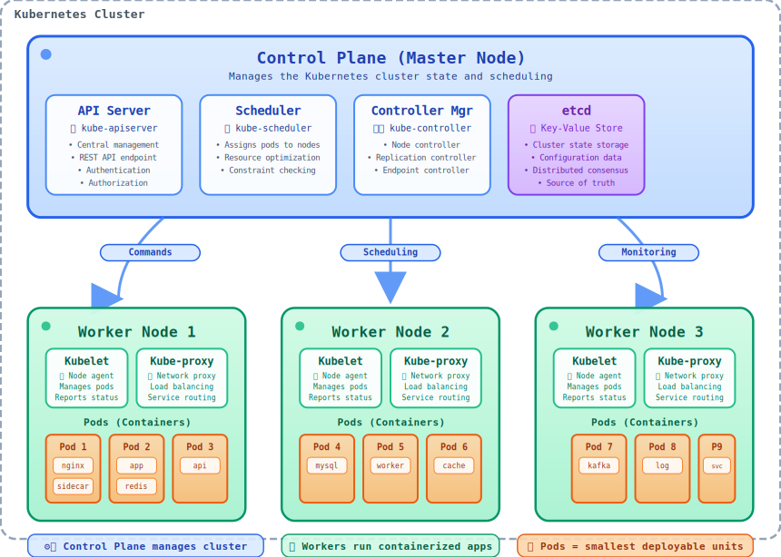

# Basic Kubernetes Commands

Below is a comprehensive guide to the essential **Kubernetes** (`kubectl`) commands for beginners. These commands cover the basics of managing **Kubernetes** clusters and resources using `kubectl`, the command-line tool for **Kubernetes**.

## Kubernetes Architecture Overview



**Kubernetes** (**K8s**) is an open-source platform for orchestrating containerized applications. The diagram above shows the main components of a **Kubernetes** cluster including the control plane and worker nodes.

> [!IMPORTANT]
> **Kubernetes** automates the deployment, scaling, and management of containerized applications across clusters of hosts.

- **Check `kubectl` version**
  ```bash
  kubectl version --client
  ```
  Displays the version of the `kubectl` client.

- **Get cluster information**
  ```bash
  kubectl cluster-info
  ```
  Shows details about the **Kubernetes** cluster, such as the control plane endpoint.

- **List all nodes**
  ```bash
  kubectl get nodes
  ```
  Displays all nodes in the cluster.

## Pods


Pods are the smallest deployable units in **Kubernetes**. A pod represents a single instance of a running process in your cluster.

- **List all pods**
  ```bash
  kubectl get pods
  ```
  Shows all pods in the current namespace. Use `-A` to list pods across all namespaces.

- **Get pod details**
  ```bash
  kubectl get pods -o wide
  ```
  Shows pods with additional details like node assignment and IP addresses.

- **Watch pods in real-time**
  ```bash
  kubectl get pods -w
  ```
  Continuously monitors pod status changes.

- **Create a resource from a file**
  ```bash
  kubectl apply -f <filename>.yaml
  ```
  Creates or updates resources *(e.g., `pods`, `deployments`)* from a `YAML` or `JSON` file.

- **Delete a resource**
  ```bash
  kubectl delete <resource> <name>
  ```
  Deletes a resource (e.g., `kubectl delete pod my-pod` or `kubectl delete -f <filename>.yaml`).

- **Describe a resource**
  ```bash
  kubectl describe <resource> <name>
  ```
  Provides detailed information about a specific resource (e.g., `kubectl describe pod my-pod`).

- **View pod logs**
  ```bash
  kubectl logs <pod-name>
  ```
  Displays logs for a specific pod. Use `-c <container-name>` for a specific container in a pod.

- **Execute a command in a pod**
  ```bash
  kubectl exec -it <pod-name> -- <command>
  ```
  Runs a command interactively in a pod *(e.g., `kubectl exec -it my-pod -- bash`)*.

## Deployments


Deployments manage `ReplicaSets` and provide declarative updates to applications. They enable rolling updates and rollbacks.

- **List deployments**
  ```bash
  kubectl get deployments
  ```
  Shows all deployments in the current namespace.

- **Scale a deployment**
  ```bash
  kubectl scale deployment <deployment-name> --replicas=<number>
  ```
  Scales a deployment to the specified number of replicas *(e.g., `kubectl scale deployment my-app --replicas=3`)*.

- **Rolling update a deployment**
  ```bash
  kubectl set image deployment/<deployment-name> <container-name>=<new-image>
  ```
  Updates the container image and triggers a rolling update.

- **Rollback a deployment**
  ```bash
  kubectl rollout undo deployment/<deployment-name>
  ```
  Rolls back to the previous version of the deployment.

- **Check deployment status**
  ```bash
  kubectl rollout status deployment/<deployment-name>
  ```
  Shows the status of a deployment rollout.

- **View deployment history**
  ```bash
  kubectl rollout history deployment/<deployment-name>
  ```
  Displays the rollout history for a deployment.

## Services


Services provide stable network access to a set of pods. They abstract the pod `IP` addresses and provide load balancing.

- **List services**
  ```bash
  kubectl get services
  ```
  Displays all services in the current namespace.

- **Expose a deployment as a service**
  ```bash
  kubectl expose deployment <deployment-name> --port=<port> --type=<type>
  ```
  Creates a service for a deployment *(e.g., `kubectl expose deployment my-app --port=80 --type=ClusterIP`)*.

- **Get service endpoints**
  ```bash
  kubectl get endpoints
  ```
  Shows the endpoints (pod IPs) that a service routes traffic to.

- **Port forward to a service**
  ```bash
  kubectl port-forward service/<service-name> <local-port>:<service-port>
  ```
  Forwards local port to service port for testing (e.g., `kubectl port-forward service/my-app 8080:80`).

## Namespaces and Context

- **Switch namespace**
  ```bash
  kubectl config set-context --current --namespace=<namespace>
  ```
  Sets the current namespace for `kubectl` commands.

- **List namespaces**  
  ```bash
  kubectl get namespaces
  ```
  Shows all available namespaces.

- **Create a namespace**  
  ```bash
  kubectl create namespace <namespace-name>
  ```
  Creates a new namespace.

- **Get current context**
  ```bash
  kubectl config current-context
  ```
  Shows the current **Kubernetes** context.

- **Switch context**
  ```bash
  kubectl config use-context <context-name>
  ```
  Switches to a different **Kubernetes** context.

## ConfigMaps and Secrets

- **List ConfigMaps**
  ```bash
  kubectl get configmaps
  ```
  Shows all `ConfigMaps` in the current namespace.

- **List Secrets**
  ```bash
  kubectl get secrets
  ```
  Shows all secrets in the current namespace.

- **Create a ConfigMap**
  ```bash
  kubectl create configmap <name> --from-literal=key=value
  ```
  Creates a `ConfigMap` with key-value pairs.

- **Create a Secret**
  ```bash
  kubectl create secret generic <name> --from-literal=username=admin --from-literal=password=secret
  ```
  Creates a secret with sensitive data.

## Monitoring and Debugging

- **Get resource usage**
  ```bash
  kubectl top nodes
  kubectl top pods
  ```
  Shows resource usage for nodes and pods.

- **Get events**
  ```bash
  kubectl get events --sort-by=.metadata.creationTimestamp
  ```
  Shows cluster events sorted by creation time.

- **Debug a pod**
  ```bash
  kubectl debug <pod-name> -it --image=busybox
  ```
  Creates a temporary debug container in a pod.

> [!TIP]
> 
> - **Configuration**: Ensure `kubectl` is configured with a valid `kubeconfig` file (usually at `~/.kube/config`) to connect to your cluster.
> - **Resource types**: Common resources include `pod`, `deployment`, `service`, `configmap`, and `secret`.
> - **Shorthand**: Use aliases like `kubectl get po` for pods or `kubectl get svc` for services.
> - **Help**: Use `kubectl --help` or `kubectl <command> --help` for more details on any command.
> - **Debugging**: Use `kubectl describe` and `kubectl logs` to troubleshoot issues with resources.

> [!IMPORTANT]
> 
> This covers the core `kubectl` commands to get started with **Kubernetes**. Practice these in a test cluster (e.g., using [`Minikube`](https://minikube.sigs.k8s.io/docs/start/?arch=%2Flinux%2Fx86-64%2Fstable%2Fbinary+download) or a cloud provider) to build familiarity!

[Go Back](../README.md)
