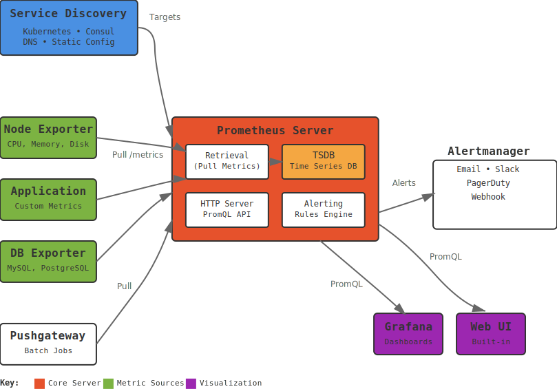
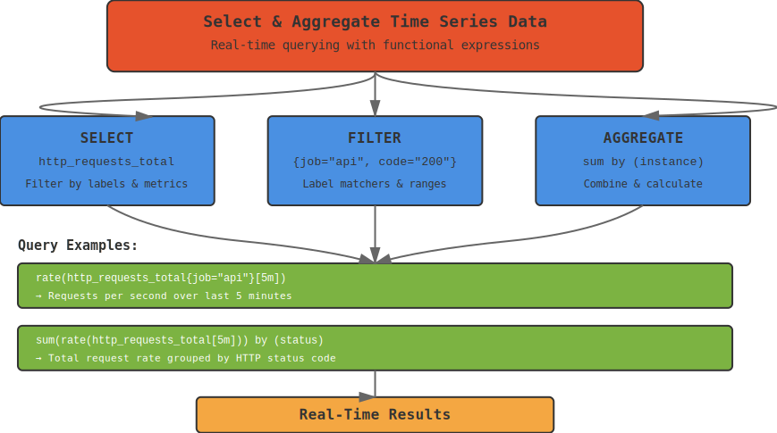
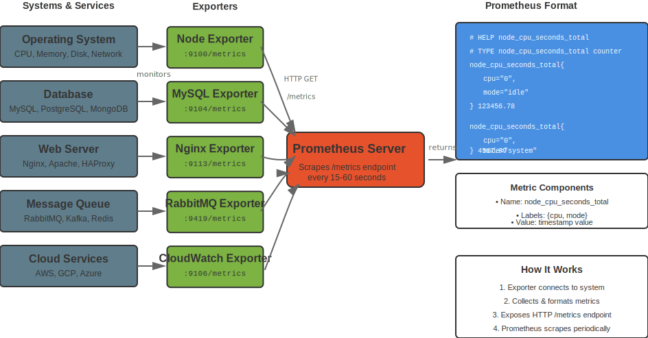
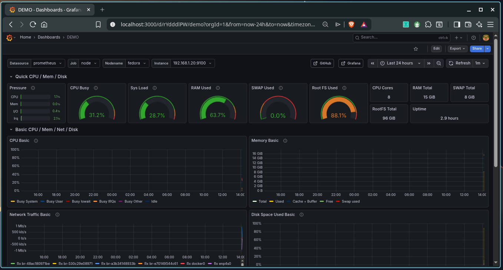

# Basic Prometheus Monitoring Commands

**Prometheus** is an open-source systems monitoring and alerting toolkit originally built at `SoundCloud`. It collects metrics from configured targets at given intervals, evaluates rule expressions, displays the results, and can trigger alerts if some condition is observed to be true.

## Prometheus Architecture Overview



The diagram above shows **Prometheus**' architecture with the main server, service discovery, and various exporters collecting metrics from different sources.

> [!IMPORTANT]
> 
> **Prometheus** uses a pull-based model where it scrapes metrics from configured targets at regular intervals.

## Prometheus Installation and Setup

- **Check Prometheus version**
  ```bash
  prometheus --version
  ```
  Displays the installed Prometheus version.

- **Start Prometheus service**
  ```bash
  sudo systemctl start prometheus
  sudo systemctl enable prometheus
  ```
  Starts and enables Prometheus to run on boot.

- **Check Prometheus status**
  ```bash
  sudo systemctl status prometheus
  ```
  Shows the current status of the Prometheus service.

- **Access Prometheus web interface**
  ```
  http://localhost:9090
  ```
  Opens Prometheus web interface in your browser (default port `9090`).

## Prometheus Configuration

### Basic Configuration File (`prometheus.yml`)

```yaml
global:
  scrape_interval: 15s
  evaluation_interval: 15s

rule_files:
  - "alert_rules.yml"

scrape_configs:
  - job_name: 'prometheus'
    static_configs:
      - targets: ['localhost:9090']
  
  - job_name: 'node-exporter'
    static_configs:
      - targets: ['localhost:9100']
```

- **Validate configuration**
  ```bash
  promtool check config prometheus.yml
  ```
  Validates the **Prometheus** configuration file.

- **Test configuration**
  ```bash
  promtool check rules alert_rules.yml
  ```
  Validates alerting rules configuration.

- **Reload configuration**
  ```bash
  curl -X POST http://localhost:9090/-/reload
  ```
  Reloads **Prometheus** configuration without restart.

## Prometheus Query Language (PromQL)



**PromQL** is a functional query language that lets you select and aggregate time series data in real time.

### Basic Queries

- **Query all metrics**
  ```promql
  up
  ```
  Shows the status of all targets (`1 = up`, `0 = down`).

- **Query specific metric**
  ```promql
  node_cpu_seconds_total
  ```
  Shows CPU time spent in different modes.

- **Query with label filters**
  ```promql
  node_cpu_seconds_total{cpu="0", mode="idle"}
  ```
  Filters metrics by specific label values.

- **Query with time range**
  ```promql
  node_cpu_seconds_total[5m]
  ```
  Shows metric values over the last 5 minutes.

### Aggregation Functions

- **Sum by labels**
  ```promql
  sum(node_cpu_seconds_total) by (mode)
  ```
  Sums CPU time grouped by mode.

- **Average over time**
  ```promql
  avg_over_time(node_cpu_seconds_total[5m])
  ```
  Calculates average value over 5 minutes.

- **Rate calculation**
  ```promql
  rate(node_cpu_seconds_total[5m])
  ```
  Calculates per-second rate of increase.

- **Count instances**
  ```promql
  count(up == 1)
  ```
  Counts the number of up targets.

## Prometheus Exporters



Exporters are applications that expose metrics in **Prometheus** format for various systems and services.

### Node Exporter

- **Install Node Exporter**
  ```bash
  wget https://github.com/prometheus/node_exporter/releases/download/v1.6.1/node_exporter-1.6.1.linux-amd64.tar.gz
  tar xvfz node_exporter-1.6.1.linux-amd64.tar.gz
  ```

- **Start Node Exporter**
  ```bash
  ./node_exporter
  ```
  Starts the Node Exporter on port 9100.

- **Common Node Exporter metrics**:
  - `node_cpu_seconds_total`: CPU time spent in different modes
  - `node_memory_MemTotal_bytes`: Total memory
  - `node_filesystem_size_bytes`: Filesystem size
  - `node_network_receive_bytes_total`: Network bytes received

### cAdvisor (Container Metrics)

- **Run cAdvisor with Docker**
  ```bash
  docker run -d --name=cadvisor -p 8080:8080 -v /:/rootfs:ro -v /var/run:/var/run:ro -v /sys:/sys:ro -v /var/lib/docker/:/var/lib/docker:ro google/cadvisor:latest
  ```

- **Common cAdvisor metrics**:
  - `container_cpu_usage_seconds_total`: Container CPU usage
  - `container_memory_usage_bytes`: Container memory usage
  - `container_network_receive_bytes_total`: Container network receive

### Custom Application Metrics

- **Expose metrics endpoint** (Python example)
  ```python
  from prometheus_client import start_http_server, Counter, Histogram
  import time

  # Define metrics
  REQUEST_COUNT = Counter('app_requests_total', 'Total requests')
  REQUEST_LATENCY = Histogram('app_request_duration_seconds', 'Request latency')

  # Start metrics server
  start_http_server(8000)

  # Use metrics in your application
  REQUEST_COUNT.inc()
  with REQUEST_LATENCY.time():
      # Your application logic
      pass
  ```

## Prometheus Alerting


**Prometheus** handles alerting through Alertmanager, which manages alerts sent by client applications.

### Alert Rules

```yaml
groups:
- name: example
  rules:
  - alert: HighCPUUsage
    expr: 100 - (avg by(instance) (rate(node_cpu_seconds_total{mode="idle"}[5m])) * 100) > 80
    for: 5m
    labels:
      severity: warning
    annotations:
      summary: "High CPU usage detected"
      description: "CPU usage is above 80% for more than 5 minutes"

  - alert: ServiceDown
    expr: up == 0
    for: 1m
    labels:
      severity: critical
    annotations:
      summary: "Service is down"
      description: "Service {{ $labels.instance }} has been down for more than 1 minute"
```

- **Create alert rules file**  
  ```bash
  sudo nano /etc/prometheus/alert_rules.yml
  ```
  Creates alert rules configuration.

- **Reload alert rules**  
  ```bash
  curl -X POST http://localhost:9090/-/reload
  ```
  Reloads alert rules without restart.

## Alertmanager Configuration

### Basic Alertmanager Config (alertmanager.yml)

```yaml
global:
  smtp_smarthost: 'localhost:587'
  smtp_from: 'alerts@example.com'

route:
  group_by: ['alertname']
  group_wait: 10s
  group_interval: 10s
  repeat_interval: 1h
  receiver: 'web.hook'

receivers:
- name: 'web.hook'
  webhook_configs:
  - url: 'http://127.0.0.1:5001/'
```

- **Start Alertmanager**
  ```bash
  alertmanager --config.file=alertmanager.yml
  ```
  Starts Alertmanager with configuration.

- **Access Alertmanager**
  ```
  http://localhost:9093
  ```
  Opens Alertmanager web interface.

## Prometheus Service Discovery

### Static Configuration

```yaml
scrape_configs:
  - job_name: 'static-targets'
    static_configs:
      - targets: ['server1:9100', 'server2:9100']
        labels:
          environment: 'production'
```

### File-based Service Discovery

```yaml
scrape_configs:
  - job_name: 'file-sd'
    file_sd_configs:
      - files: ['/etc/prometheus/targets/*.yml']
        refresh_interval: 5m
```

- **Create targets file**
  ```bash
  mkdir -p /etc/prometheus/targets
  echo "- targets: ['server1:9100']" > /etc/prometheus/targets/servers.yml
  ```

### DNS-based Service Discovery

```yaml
scrape_configs:
  - job_name: 'dns-sd'
    dns_sd_configs:
      - names: ['_prometheus._tcp.example.com']
        type: 'SRV'
        port: 9090
```

## Prometheus Recording Rules

### Recording Rules Configuration

```yaml
groups:
- name: recording_rules
  rules:
  - record: job:node_cpu_usage_percent
    expr: 100 - (avg by(job) (rate(node_cpu_seconds_total{mode="idle"}[5m])) * 100)
  
  - record: job:node_memory_usage_percent
    expr: (1 - (node_memory_MemAvailable_bytes / node_memory_MemTotal_bytes)) * 100
```

- **Create recording rules**
  ```bash
  sudo nano /etc/prometheus/recording_rules.yml
  ```
  Creates recording rules configuration.

## Prometheus Federation

### Federation Configuration

```yaml
scrape_configs:
  - job_name: 'federate'
    scrape_interval: 15s
    honor_labels: true
    metrics_path: '/federate'
    params:
      'match[]':
        - '{job=~"prometheus"}'
        - '{__name__=~"job:.*"}'
    static_configs:
      - targets:
        - 'prometheus-server-1:9090'
        - 'prometheus-server-2:9090'
```

## Prometheus Storage and Retention

- **Check storage usage**
  ```bash
  du -sh /var/lib/prometheus/
  ```
  Shows Prometheus storage usage.

- **Configure retention**
  ```yaml
  # In prometheus.yml
  global:
    external_labels:
      cluster: 'production'
    scrape_interval: 15s
    evaluation_interval: 15s
  ```

- **Backup Prometheus data**
  ```bash
  tar -czf prometheus-backup-$(date +%Y%m%d).tar.gz /var/lib/prometheus/
  ```

## Prometheus API

### Query API

- **Instant query**
  ```bash
  curl 'http://localhost:9090/api/v1/query?query=up'
  ```
  Executes an instant query.

- **Range query**
  ```bash
  curl 'http://localhost:9090/api/v1/query_range?query=up&start=2023-01-01T00:00:00Z&end=2023-01-01T23:59:59Z&step=15s'
  ```
  Executes a range query.

- **List targets**
  ```bash
  curl 'http://localhost:9090/api/v1/targets'
  ```
  Lists all configured targets.

- **List rules**
  ```bash
  curl 'http://localhost:9090/api/v1/rules'
  ```
  Lists all recording and alerting rules.

## Grafana Integration



Grafana is commonly used with **Prometheus** for visualization and dashboards.

- **Add Prometheus data source**
  ```
  URL: http://localhost:9090
  Access: Server (default)
  ```

- **Import Prometheus dashboard**
  ```
  Dashboard ID: 1860 (Node Exporter Full)
  ```

## Monitoring Best Practices

### Metric Naming

- Use descriptive names: `http_requests_total` not `requests`
- Include units: `memory_usage_bytes` not `memory_usage`
- Use consistent naming: `service_*` for all service metrics

### Label Usage

- Keep cardinality low: Avoid high-cardinality labels
- Use meaningful labels: `environment`, `service`, `instance`
- Avoid user-specific labels: Don't use user IDs as labels

### Query Optimization

- Use recording rules for expensive queries
- Limit time ranges in queries
- Use appropriate functions: `rate()` for counters, `increase()` for totals

## Common Prometheus Queries

### System Metrics

```promql
# CPU usage percentage
100 - (avg by(instance) (rate(node_cpu_seconds_total{mode="idle"}[5m])) * 100)

# Memory usage percentage
(1 - (node_memory_MemAvailable_bytes / node_memory_MemTotal_bytes)) * 100

# Disk usage percentage
100 - ((node_filesystem_avail_bytes * 100) / node_filesystem_size_bytes)

# Network traffic rate
rate(node_network_receive_bytes_total[5m])
```

### Application Metrics

```promql
# Request rate
rate(http_requests_total[5m])

# Error rate
rate(http_requests_total{status=~"5.."}[5m]) / rate(http_requests_total[5m])

# Response time percentile
histogram_quantile(0.95, rate(http_request_duration_seconds_bucket[5m]))
```

> [!TIP]
>
> - **Configuration**: **Prometheus** config is typically at `/etc/prometheus/prometheus.yml`
> - **Data Directory**: **Prometheus** data is stored in `/var/lib/prometheus/` by default
> - **Retention**: Configure appropriate retention periods based on storage capacity
> - **Scraping**: Use appropriate scrape intervals (15s-1m) based on your needs
> - **Alerting**: Test alert rules thoroughly before deploying to production
> - **Dashboards**: Use **Grafana** for better visualization and alerting
> - **Federation**: Use federation for multi-cluster monitoring
> - **Recording Rules**: Use recording rules to pre-compute expensive queries

[Go Back](../README.md)
